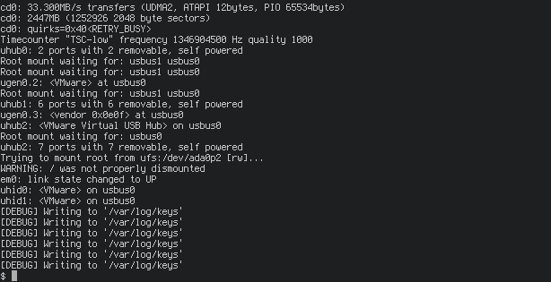
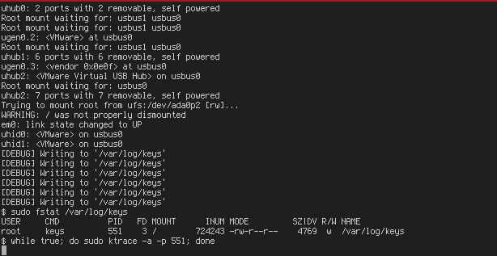
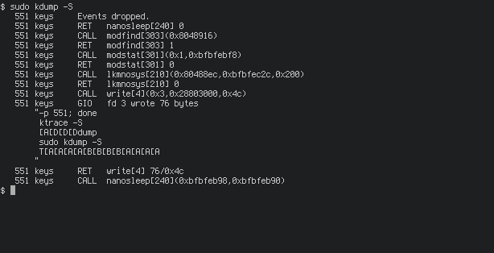
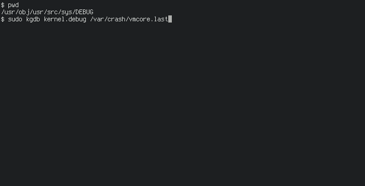

# Rootkit CTF
## By Alex Kerr, 2016-09-23

The challenge informs the user to SSH into a server affected by a kernel-space
keylogger. They are also informed that some debugging features appear to be
left in. This should prompt the player to view kernel messages with `dmesg`.



Here, the output shows the file `/var/logs/keys` is being written to.
Investigating this shows it contains the keylogger output. The next challenge
is to work out which process is interacting with this file. This can be
achieved with `fstat` or `lsof`.


This shows the process 'keys' is being run by root and is interacting with the
keylogger output file. This is a user-space process, however, and the debug
message was in the kernel messages. This implies the process is interacting
with the kernel in some way. This should lead the player to want to investigate
the process with `strace`, however this command is not available in FreeBSD.
Instead, the player must research and learn about `truss`, `ktrace` and
`kdump`. Using the former, we can see a syscall is made to 'modfind' and then
'modstat' in order to locate an unknown syscall called 'sys/logging'. An
unknown syscall is then called immediately after, presumably the one that had
been found.


The player will then need to interact with this syscall. However, they first
need the syscall offset number. To do this, they could either write a C program
that uses 'modfind' to retrieve this by the syscall name, or use a tool to do
it. `truss` does not provide this, but `kdump` does. This first requires use of
`ktrace`, however attaching `ktrace` directly to the process causes it to exit
immediately without giving any output. To solve this, the player must put it in
an infinite loop and use the 'append' mode of `trace`, then wait a minute for
the 'keys' process to make the syscall again.



Once the syscall is captured, the player can use the `-S` option of `kdump` to
obtain the offset number.



With this, the user can now interact with syscall. Some simple analysis of the
arguments shows that it takes two addresses - likely string pointers - and an
integer (512). The user will want to interact with the syscall and try out
different combinations of these arguments. This can be done with a scripting
language such as `perl`. The user's first instinct may be to try using three
zeros as arguments. This seemingly gives no output, however investigating
`dmesg` once more shows it did, showing the player they are on the right track.


While the syscall is able to handle an address of zero to print, it will still
crash when given a different address to try and dereference. For example:


This crashes the kernel. The system will reboot and create a crash dump. Once
the operating system is back, the player can SSH back in. They now need to use
a kernel debugger to inspect the crash dump. Instructions on how to do this are
hiding in plain sight, in the FreeBSD Developer's Handbook, which is linked in
the motd.


The documentation there explains how to use `kgdb`. This process can be
repeated by the player to inspect the crash dump.



Finally, the player can inspect the crash dump and see the obviously named
'rootkit.c'. Moving up the stack trace will allow player to inspect this file,
and using gdb to print the file will reveal the key.


## Command Cheat Sheet

```shell
dmesg
sudo fstat /var/log/keys
sudo truss -p <pid>
while true; do sudo ktrace -a -p <pid>; done
sudo kdump -S
perl -e 'syscall(210, 0, 0, 0)'
perl -e 'syscall(210, 1, 0, 0)'
cd /usr/obj/usr/src/sys/DEBUG/
sudo kgdb kernel.debug /var/crash/vmcore.last
up # repeat until at the 'rootkit.c' stack frame
list 0
list
```
